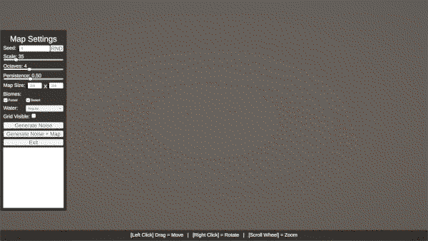
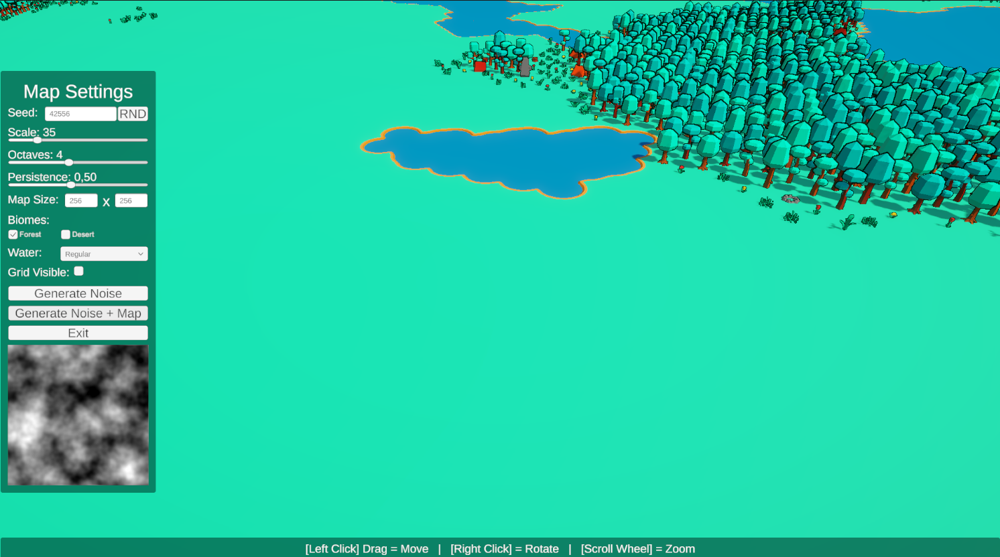
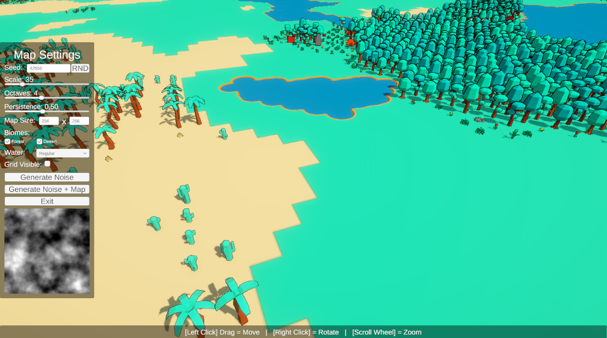
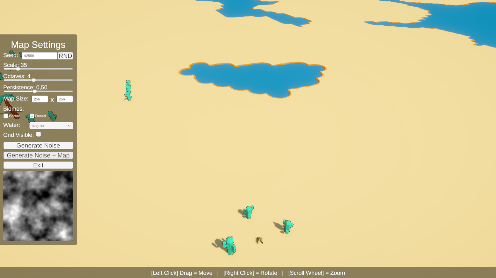

# Unity Procedural World Generator  
### Deterministic Perlin Noise · Biomes · Shorelines · Chunk Streaming

A Unity (C#) procedural world generation system focused on deterministic data generation, clear separation between logic and rendering, and practical performance constraints — common requirements in simulation, factory, and strategy games.

This project intentionally prioritizes systems design over visuals: reproducible worlds, predictable rules, and scalable rendering.

Same seed → same world, every time.

---

## What problem this solves

Large, procedural worlds are easy to generate once — but hard to:
- Reproduce deterministically
- Stream efficiently
- Extend with rules (biomes, decorations, shorelines)
- Keep decoupled from rendering logic

This project demonstrates a data-first generation pipeline where:
- World generation is pure, deterministic, and testable
- Rendering is chunked and disposable
- Visual details (shorelines, decorations) are precomputed, not inferred at render time

---

## Features

- Seed-based deterministic generation
- Perlin-noise land / water classification
- Biome system (Forest / Desert) with:
  - Hot & dry rule
  - Configurable shoreline buffer
- Precomputed shoreline pieces  
  (each water tile stores exactly which shoreline meshes it needs)
- Deterministic decoration placement  
  (coordinate-hashed RNG → stable layouts across runs)
- Chunk-based rendering
  - Configurable chunk size
  - Configurable render radius
  - Dynamic build / destroy around camera target
- Debug grid overlay toggle
- Optional URP RenderGraph outline feature

---

## Demo

**Procedural world generation from a deterministic seed**

---

**World overview (multiple chunks loaded)**

---

**Biome transition (Forest → Desert with shoreline buffer)**

---

**Determinism proof (same seed, identical result)**

---

## Requirements

- Unity Editor: 6000.1.5f1 (Unity 6)
- Render Pipeline: URP  
  com.unity.render-pipelines.universal included

---

## Quick start

1. Open the project in Unity
2. Open the demo scene located at  
   Assets/Scenes/SampleScene.unity
3. Press Play
4. Use the UI buttons:
   - Generate Noise (preview)
   - Generate Noise + Map (generate world and spawn chunks)

### Camera controls

- Left mouse drag: pan  
- Right mouse drag: orbit  
- Mouse wheel: zoom  

Camera input is ignored while the pointer is over UI elements.

---

## Architecture overview

### 1) Generation layer (data only)

Main entry point:  
PerlinNoiseGenerator.BuildMap(...)

This produces a MapData structure containing:
- Tile type (Land / Water)
- Biome assignment
- Per-tile featureValue used for deterministic rules
- Precomputed shoreline data for water tiles

No rendering logic exists in this layer.  
Generation is fully deterministic and independent from Unity objects.

---

### 2) Rendering layer (chunked)

- ChunkRenderer visualizes the generated MapData
- Chunks are spawned and destroyed based on camera position
- Rendering cost scales with visible area, not world size
- Shoreline meshes are spawned directly from precomputed data

This keeps large worlds responsive without regenerating logic.

---

## Optional: URP RenderGraph outline feature

The project includes an Object-ID-based outline implemented with URP + RenderGraph:

- Assets/Scripts/Rendering/ObjectIdOutlineRenderGraphFeature.cs
- Assets/Scripts/Rendering/OutlineObjectId.cs

Usage:
- Assign the render feature in your URP renderer
- Configure materials
- Mark objects via layer or component

This feature is optional and independent from the generator.

---

## Project structure

Assets/Scripts/
- PerlinNoiseGenerator.cs — noise, biome rules, shoreline precompute
- Generation/MapData.cs — pure generation output (no rendering)
- Rendering/ChunkRenderer.cs — chunk streaming and prefab spawning
- UIManager.cs — seed, noise parameters, map size, biome toggles
- CameraController.cs — pan, orbit, zoom

---

## Notes on assets & licensing

This repository contains example prefabs and textures for demo clarity.

Many Unity Asset Store licenses do not allow public redistribution.  
For public or production use:
- Replace assets with placeholders, or
- Keep the repository code-only, or
- Share privately with reviewers

---

## Potential next improvements

- Split PerlinNoiseGenerator into smaller components:
  - Noise sampling
  - Biome rules
  - Shoreline evaluation
- Add automated determinism tests (same seed → same map hash)
- Add performance metrics (chunk count, visible tiles, FPS)
- Add screenshots and GIFs

---

## Why this project exists

This is not a visual showcase.  
It is a systems-focused reference implementation for deterministic procedural world generation in Unity.

Useful as:
- A foundation for simulation or strategy games
- A starting point for large procedural maps
- A reference for separating generation from rendering
